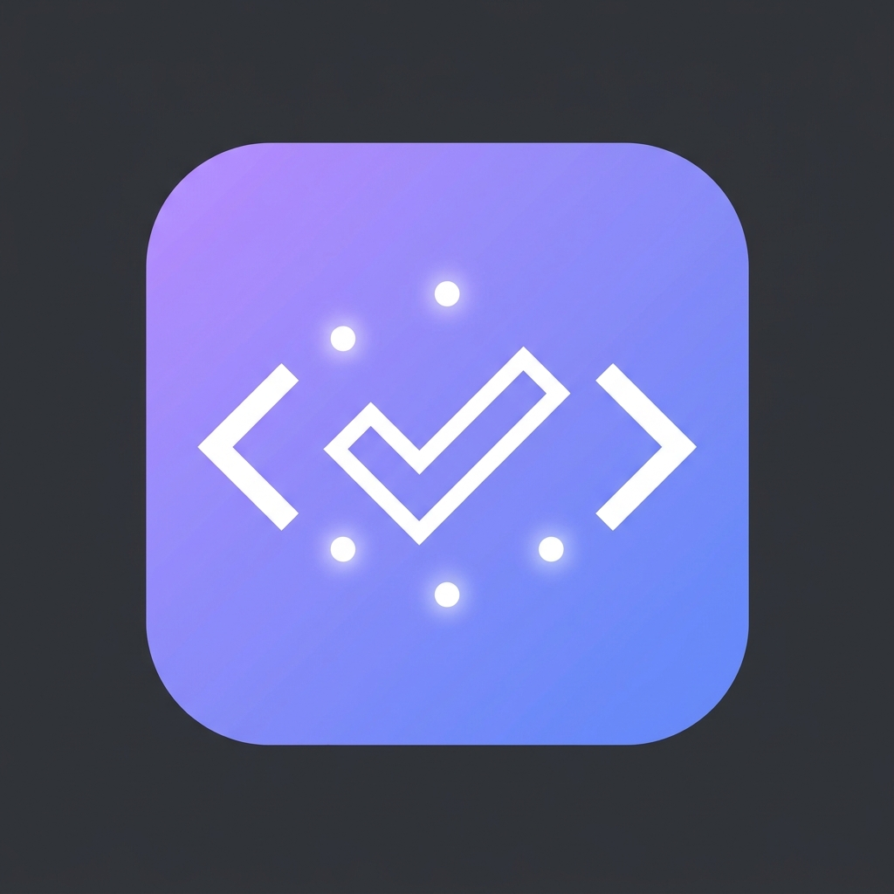

<p align="center"></p>

# vibecodereview

**A council of AI models reviews your PR — many models, one check.**

Each model reviews the diff through a different lens, so they catch different
things. Claude chairs: it verifies every claim against the code, drops false
positives, fixes what it can confirm, pushes the fix, and posts one review. The
check heals itself toward green.

Part of the **Vibe Suite**.

## Demo

A council of clay AI ninjas reviews a pull request — problem, deliberation,
verdict, self-healing fix.

▶ **[Watch the launch trailer](https://getvibe.dev/vibecodereview)** ·
[16:9](assets/vibecodereview-trailer-16x9.mp4) · [9:16](assets/vibecodereview-trailer-9x16.mp4)

## The council

| Member | Provider (called directly) | Secret | Lens |
| --- | --- | --- | --- |
| Chair | Claude (subscription OAuth) | `CLAUDE_CODE_OAUTH_TOKEN` | synthesis + conventions + tests + proof + fixes |
| GPT / Codex | api.openai.com | `OPENAI_API_KEY` | correctness, silent failures |
| Gemini | generativelanguage.googleapis.com | `GEMINI_API_KEY` | performance, type design |
| Kimi | api.moonshot.ai | `MOONSHOT_API_KEY` | security |
| DeepSeek V4 Flash | openrouter.ai | `OPENROUTER_API_KEY` | maintainability, data integrity |
| GLM 5.3 Flash (scope) | openrouter.ai | `OPENROUTER_API_KEY` | scope, atomicity, and the evidence in the body |
| Sonnet (mutation) | Claude OAuth seat | `CLAUDE_CODE_OAUTH_TOKEN` | can these tests fail at all — **off by default** |

A member with no key drops out. No key at all → the council step is skipped, and
Claude still reviews alone. Nothing here blocks the PR on a provider outage.

### Lens routing

Council members are dispatched by the **kind of file** a delta touches — never by diff
size, line count, or file count. Each lens reviews only the kinds it can speak to:

| Lens | File kinds |
| --- | --- |
| scope | always (every delta) |
| correctness | source, test, CI, deps, agent instructions |
| security | source, CI, deps, agent instructions |
| maintainability | source, test, CI, agent instructions |
| performance | source, style (CSS/SCSS/Less/Sass) |

A lockfile-only or docs-only push never reaches routing at all: the trivial-delta check
above already skips the whole council, scope included, before any lens is dispatched.
Routing only decides the roster once a delta has at least one non-inert path — a
dependency-manifest-only push (`package.json`, `go.mod`, ...) keeps scope, correctness,
and security; a test-only push keeps scope, correctness, and maintainability; a
style-only push keeps scope and performance — review weight then drops that
pair so the chair reviews CSS alone. An unparseable diff fails open and
dispatches every lens. Dropped lenses are listed in the findings as "Lenses not dispatched".

Set `VCR_LENS_ROUTING=off` to disable routing and dispatch the full roster.

### Review weight

Kind routing asks whether a lens can speak to the files. Review weight asks
whether the delta needs more than one or two speakers. It runs after routing:

| Weight | When | Council |
| --- | --- | --- |
| chair | style-only (CSS/SCSS/Less/Sass) | none — Claude reviews alone |
| light | tests and/or dependency manifests, no source | correctness plus security or maintainability |
| core | ordinary source | correctness and security |
| full | CI, agent instructions, high-risk paths (auth, payments, migrations, secrets), or an unparseable diff | whatever routing kept |

The chair still runs either way, and still judges whether the diff matches the
claim. Scope drops on chair/light/core because that job is already the chair's.
An unparseable diff fails open to `full`. Set `VCR_REVIEW_WEIGHT=off` on the
`uses:` step to restore the routed roster with no further shrinking.

The scope lens reads the PR's title, body, and linked issues from `PR_CONTEXT_FILE` when available to verify the diff matches the author's claim.

A pull request also has to show its work: a visible change carries before and after
screenshots, a command carries its result. The scope member judges that evidence against
the diff, and the chair asks for the capture that would settle it. Neither of them ever
produces the evidence itself. Set `require_proof: false` in a repo where no change is
ever visible. The rule the check enforces lives in `pr-standards.md` in
[pooriaarab/scripts](https://github.com/pooriaarab/scripts).

Evidence has to cover the diff it claims to cover. The check flags a body whose
`## How I verified` leaves untested a code path the PR changes, and one whose
capture predates the newest commit touching a path that capture exercises. It does
not ask for a recapture on every push: a commit that changes nothing the evidence
shows leaves that evidence good. `scripts/proof-gate.test.sh` pins both paths the
`require_proof` flag travels — the council scope lens and the chair's own bullet —
because the first version gated only one of them.

The chair also reads the PR against the fleet standard when the repo carries
`.github/pr-standards.json`: branch and title shape, exactly one `Closes #N`, a
`## How I verified` that names a command and its result, and the hard caps of 500 counted
lines and 40 counted files. Being over a cap is reported, never "fixed" — the chair names
the split it would make and leaves the work alone, because deleting code to fit a cap is
worse than a large PR.

**The chair never signs its commits with a model name.** Its fix commits carry no
`Co-Authored-By:` trailer, because the same standard rejects model attribution in commit
messages: a repo enforcing `pr-standards` would fail its own review bot, and the PR could
not merge until a human squashed the bot's commit away. That happened twice in
[pooriaarab/scripts](https://github.com/pooriaarab/scripts) before this was fixed.
Attribution belongs in the PR body as `Assisted-by:`, written by the author.

## Use it in a repo

```bash
npx vibecodereview init          # writes .github/workflows/vibecodereview.yml
npx vibecodereview secrets --repo owner/name   # prints the gh commands to set keys
```

Set at least `CLAUDE_CODE_OAUTH_TOKEN` (from `claude setup-token`). Add provider
keys to grow the council. Set them on **private** repos.

Or wire the action directly:

```yaml
- uses: pooriaarab/vibecodereview@v1
  with:
    claude_code_oauth_token: ${{ secrets.CLAUDE_CODE_OAUTH_TOKEN }}
    claude_code_oauth_token_2: ${{ secrets.CLAUDE_CODE_OAUTH_TOKEN_2 }}
    claude_code_oauth_token_3: ${{ secrets.CLAUDE_CODE_OAUTH_TOKEN_3 }}
    claude_code_oauth_token_4: ${{ secrets.CLAUDE_CODE_OAUTH_TOKEN_4 }}
    github_token: ${{ github.token }}
    openai_api_key: ${{ secrets.OPENAI_API_KEY }}
    gemini_api_key: ${{ secrets.GEMINI_API_KEY }}
    moonshot_api_key: ${{ secrets.MOONSHOT_API_KEY }}
    openrouter_api_key: ${{ secrets.OPENROUTER_API_KEY }}
    vibetrace_ingest_url: ${{ secrets.VIBETRACE_INGEST_URL }}
    vibetrace_ingest_token: ${{ secrets.VIBETRACE_INGEST_TOKEN }}
```

Swap models without code: `council_models` input, or the `*_MODEL` env
overrides (`OPENROUTER_MODEL=deepseek/deepseek-v4-flash`, etc.).

### The mutation lens

```yaml
    mutation_lens: "true"
```

Five lenses read the diff. This sixth one reads the **tests** and asks the
question that a green suite cannot answer: would any of these fail if the code
under them were broken?

For each test added or changed it names one concrete mutation to the code that
test covers — a `path:line` and the exact replacement — and reports a finding
when the test would survive it. It also reports the shapes that pass no matter
what: a test and its code sharing the same helper so they agree regardless, an
assertion that restates the implementation, a fixture that never reaches the
path, a value compared against itself, and a test that can only fail by hanging
(in CI that is a job timeout, not a red).

Two honest limits:

- **It proposes; it does not run.** A finding is a claim you can check in one
  command, not a measured result. Applying the mutations needs a per-repo test
  command and a sandbox, and that is a separate feature with a separate cost.
- **Off by default, and skipped on a diff that adds no test lines.** There is no
  question to ask about a documentation change, and the report says so rather
  than staying silent — silence would read as "found nothing".

`mutation_model` is the Claude CLI model name (default `claude-sonnet-5`).
Mutation runs on a Claude OAuth seat, never OpenRouter. Set
`MUTATION_PROVIDER=claude2` (or `claude3` / `claude4`) to pick a different
token so it does not share the chair's primary subscription.

### Claude subscription seats

Every other seat needs a metered API key, and those are what run dry — a repo
can sit at three-of-four members returning HTTP 429 while the posted summary
still lists four reviewers, so a PR looks multi-model reviewed when only the
chair ran.

A Claude Code OAuth token is not an API bearer, so it cannot hold a normal
seat. The `claude`, `claude2`, `claude3`, and `claude4` providers shell the
Claude Code CLI (already installed for the chair) instead of POSTing, putting
the cost on the subscription. Extra tokens (`CLAUDE_CODE_OAUTH_TOKEN_5` and
up) become `claude5` automatically. **OpenRouter must never carry a Claude,
Codex, or Grok model** — the engine skips those ids before the HTTP call.
Those families have their own subscriptions. OpenRouter is DeepSeek / GLM
only.

```yaml
council_models: >-
  claude|claude-opus-5|Claude Opus 5|correctness,
  claude2|claude-sonnet-5|Claude Sonnet 5|security,
  claude3|claude-sonnet-5|Claude Sonnet 5|performance,
  openrouter|deepseek/deepseek-v4-flash|DeepSeek V4 Flash|maintainability
```

The seats run with no tools, `--max-turns 1`, and a working directory outside
the PR checkout — `claude -p` skips the workspace-trust prompt and would
otherwise execute a repo-local `.claude/settings.json` hook with every secret
in the step's environment. Set `CLI_TIMEOUT_MS` to change their budget
(default 240000).

### Custom / OffRouter provider

Point a council member at any OpenAI-compatible gateway: OpenRouter, a
self-hosted proxy, or a local OffRouter endpoint. (OffRouter is a local
router for coding agents; if it exposes an OpenAI-compatible
`/v1/chat/completions`, set `CUSTOM_BASE_URL` to it.)

```bash
export CUSTOM_BASE_URL=https://your-gateway.example/v1/chat/completions
export CUSTOM_API_KEY=...
export COUNCIL_MODELS="custom|<model>|Name|lens"
```

No `CUSTOM_BASE_URL` → the member skips with a note, same as a missing key.

## What the chair's commits look like

A fix the chair pushes is authored by `vibecodereview[bot]`, and it carries no
model trailer. The Claude Code CLI adds `Co-Authored-By: Claude <model>` by
default, and a fleet running the `pr-standards` check rejects a commit trailer
that names a model or an agent — so the chair used to push a fix that turned the
pull request red, on a commit its author could not amend because they did not
make it.

A `prepare-commit-msg` hook strips it, rather than a line in the chair's prompt:
a prompt is a request to a model, and this has to hold every time. A
`Co-authored-by` naming a human, or `vibecodereview` itself, is left alone.

## What a fix cycle costs

When the chair pushes a fix, that is a real commit on the PR branch, so GitHub
raises a `synchronize` event. Every *other* workflow in the repo that triggers on
`pull_request` runs again. The cost does not show up against this action — it
shows up as extra runs of your test, lint, build and e2e workflows.

The arithmetic, for a repo with five `pull_request` workflows and the default
`max_fix_cycles: 3`:

```
1 human push        -> 5 workflow runs
3 chair fix commits -> 15 more
                       20 runs for one PR
```

Two things to set, especially if agents open most of your PRs:

- **Lower `max_fix_cycles`** to 1 or 2 on high-volume repos. Fixes past the
  second pass are usually the chair arguing with itself, and each one costs a
  full pipeline.
- **Give every `pull_request` workflow a `concurrency` group** so a fix commit
  cancels the run it superseded instead of stacking beside it. `init` already
  writes one into `vibecodereview.yml`; hand-written workflows often lack it.

### The ceiling that stops a runaway

`max_fix_cycles` caps how often the chair pushes. It caps nothing else, so a pull
request can still be reviewed again and again while its author pushes, and the
arithmetic above repeats every time. A pull request on its sixth review is not
converging, and a seventh costs what the first cost.

One ceiling stops it, on by default:

| Input | Default | Counts |
|---|---|---|
| `max_council_runs` | `3` | reviews from `claude[bot]` on the pull request |

Set it to `0` to disable.

Over the ceiling, the action skips the council and the chair, labels the pull
request `needs-human`, and leaves one comment saying which ceiling it hit and
what to decide. It edits that comment rather than posting another. **The check
still passes.** A budget stop is a routing decision, not a verdict on the code,
and a red check there would hide a real failure behind a bookkeeping one.

Both numbers come from one API call. Real billable minutes need a request per
run, which turns a guard against waste into a source of it — so the ceilings
count runs, on the reasoning that every run of a workflow costs about what the
last one did. `scripts/budget-guard.test.sh` pins the arithmetic, including the
case that matters most: a failed lookup reads as "no spend yet", never as "out
of budget", so an API blip cannot stop every review in the fleet.

```yaml
concurrency:
  group: ci-${{ github.ref }}
  cancel-in-progress: true
```

Use `cancel-in-progress: true` for test, lint and scan workflows. Leave it
`false`, or omit the group, on anything that deploys or runs migrations —
cancelling those midway is worse than queueing.

Set `can_push_fixes: false` to get review comments with no commits at all, which
costs one pipeline per PR.

## Set up across many repos

`bin/rollout.mjs` rolls the action out to a fleet of repos. For each repo it
sets the 5 secrets from your environment and opens one PR that adds the
owner-gated workflow. It is idempotent: re-running re-sets secrets and
reuses the branch and PR. It never merges.

```bash
node bin/rollout.mjs --dry-run owner/a owner/b   # preview; changes nothing
node bin/rollout.mjs owner/a owner/b             # or REPOS="owner/a,owner/b"
```

Once the rollout PRs are green, merge them with `bin/merge-rollout.mjs`:

```bash
node bin/merge-rollout.mjs --lenient owner/a owner/b
```

It merges only PRs whose vibecodereview check passed. `--lenient` ignores
unrelated red CI on the repo (safe: a rollout PR only adds one file). It
never merges while the vibecodereview check is pending or failing.

## Review a local diff before you push

```bash
export OPENAI_API_KEY=... MOONSHOT_API_KEY=...   # whichever members you want
vibecodereview review --base origin/main
```

## Review open PRs across repos

```bash
vibecodereview review-prs owner/a owner/b        # print findings per open PR
vibecodereview review-prs --post --repo owner/a  # also comment on each PR
```

Needs an authenticated `gh`. One failing PR does not stop the batch.

## As an MCP tool

```bash
claude mcp add vibecodereview -- node /path/to/vibecodereview/mcp/server.mjs
```

Exposes one tool, `council_review(diff)`. Provider keys come from the server env.

## Notes

- Subscriptions (codex-personal, gemini-personal, muse) don't reach a CI runner —
  CI uses each provider's **API key**. Only Claude's OAuth token ports to CI.
- Rotate any key you paste into a chat or terminal history.
- **Vibetrace Ingestion**: Supply the optional `VIBETRACE_INGEST_URL` and `VIBETRACE_INGEST_TOKEN` as repository secrets to forward completed council run trace metrics and records to a centralized telemetry ingest server. When unset, telemetry traces are stored under `RUNNER_TEMP` as JSONL files.
